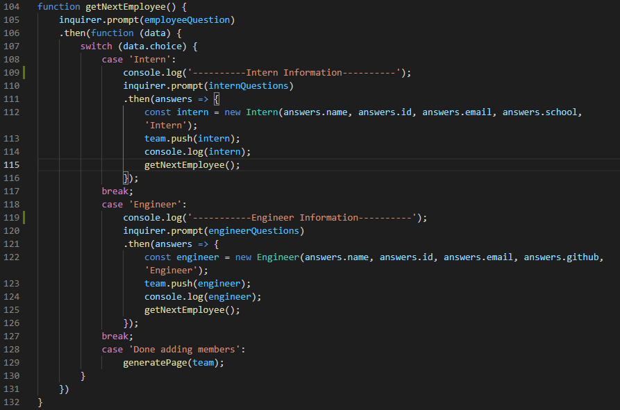
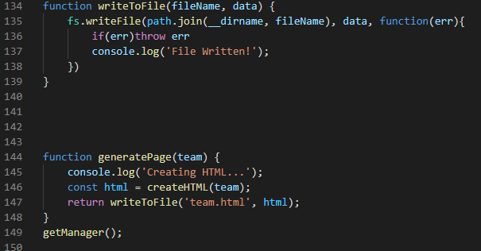
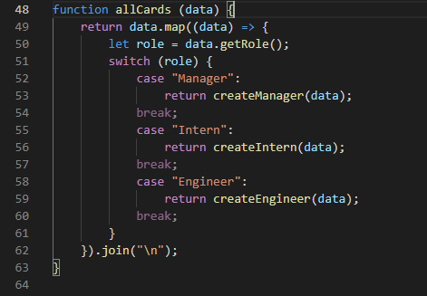
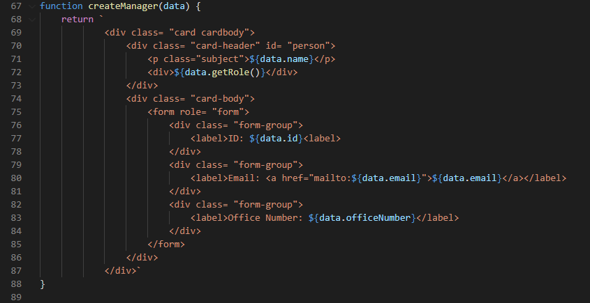

# Team Profile Generator

  

## Description

In this assignemnt I was prompted with the task of creating a Team Profile Generator for a manager. A manager is able to run the application and generate basic info of employees onto a brand new HTML page. The console will prompt the user with questions based off of the criteria they selected ('Intern' or 'Engineer'). The user can add as many employees as they would like until they select done. On selecting done, the HTML page will be generated. The following is brief overview of how the process went.

Find out how to use this application here!

[Video](https://drive.google.com/file/d/1wVbb6mU6UH3nipV2D6t3HShhaN7QBFi7/view?usp=sharing)

## Table of Contents

* [Installation](#installation)

* [Usage](#usage)

* [Contribute](#contribute)

* [Tests](#tests)

* [Technology](#technology)

* [Making](#making)

* [Questions](#questions)

## Installation

In order to run this application, you will need to install the following:

  - npm install jest / npm install inquirer

## Usage

In order to use this app, you will need to understand the following langauges:

  - HTML, Node, Javascript

## Contribute 
    
In order to contribute, you will need to know the following languges:
    
  - HTML, Node, Javascript

## Tests

To run tests, please use the following command:

  - npm run test

## Technology

- GitHub - repository storage for the project in order to amke changes, deploy them and push to a main branch. 

- GitBash - used for written commands and communicating with the repository stored on GitHub.

- HTML - used to create and edit electronic documents stored on the web.

- CSS - used to edit style and appearance of the website.

- Javascript - a programming language that makes your webpage user interactive.

- Node.js - an efficient platform that runs Javascript outside of the web browser.

## Making

How was it made? Take a look here!

Get Employee Function

Generate Page Function

Card Selector Function

Card Generator

## Questions

Please click the link to see my Full GitHub profile:

[GitHub](https://github.com/dnovelli1)

If you have any questions, please see the following links to best get in contact with me:

[Email Me](jakenovelli11@gmail.com)

## License

This project is currently licensed under the MIT [License](https://choosealicense.com/licenses/mit/)
  

